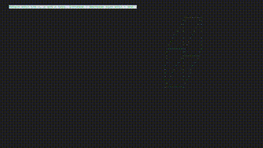

# 3d-terminal-rendering
A 3d cube demo using termbox.

## How to build:
1. Install termbox development files: 
* Void Linux: xbps-install termbox-devel
* Debian based distros: apt install libtermbox-dev 
* Arch based distros: install the termbox-git package from the AUR. 
2. git clone https://github.com/mathijskr/3d-terminal-rendering
3. cd 3d-terminal-rendering
4. make

## How to run:
1. cd 3d-terminal-rendering
2. make run

## Dependencies:
* A c-compiler.
* GNU Make
* Termbox development files.
